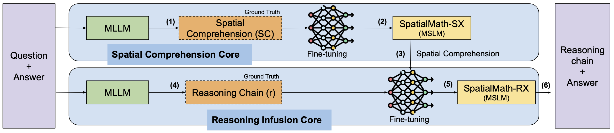

<h1 align="center">
<br>
SpatialMath: Spatial Comprehension-Infused Symbolic Reasoning for Mathematical Problem-Solving
</h1>


<p align="center">
  <a href="https://www.lcs2.in/"><b>[🌐 LCS2 Lab]</b></a> •
  <a href=""><b>[📜 Paper]</b></a> •
  <a href="https://github.com/ab-iitd/spatial-math/"><b>[🐱 GitHub]</b></a>
  
</p>


<p align="center">
Repo for "<a href="" target="_blank">SpatialMath: Spatial Comprehension-Infused Symbolic Reasoning for Mathematical Problem-Solving</a>"
</p>


## 🔥 News

- [2026/01/04] SpatialMath is accepted at EACL 2026 (Findings)!


## 💡 Framework

<p align="center" width="100%">
    
</p>


## 💡 Abstract

<details close>
<summary> Abstract of SpatialMath</summary>

Multimodal Small-to-Medium sized Language Models (MSLMs) have demonstrated strong capabilities in integrating visual and textual information but still face significant limitations in visual comprehension and mathematical reasoning, particularly in geometric problems with diverse levels of visual infusion. Current models struggle to accurately decompose intricate visual inputs and connect perception with structured reasoning, leading to suboptimal performance. To address these challenges, we propose SpatialMath, a novel Spatial Comprehension-Infused Symbolic Reasoning Framework designed to integrate spatial representations into structured symbolic reasoning chains. SpatialMath employs a specialized perception module to extract spatially-grounded representations from visual diagrams, capturing critical geometric structures and spatial relationships. These representations are then methodically infused into symbolic reasoning chains, facilitating visual comprehension-aware structured reasoning. To this end, we introduce MATHVERSE-PLUS, a novel dataset containing structured visual interpretations and step-by-step reasoning paths for vision-intensive mathematical problems. SpatialMath significantly outperforms strong multimodal baselines, achieving up to 10 percentage points improvement over supervised fine-tuning with data augmentation in vision-intensive settings. Robustness analysis reveals that enhanced spatial representations directly improve reasoning accuracy, reinforcing the need for structured perception-to-reasoning pipelines in MSLMs.

</details>


## 🔧 Repo Structure
This repo contains the training scripts and path for MATHVERSE-PLUS dataset. Detailed structure is as follow:
```
.
├── README.md
├── [Update Soon]
```
## MATHVERSE-PLUS Resource
The MATHVERSE-PLUS dataset is avaiable at HuggingFace. <a href="https://huggingface.co/datasets/ab-iitd/MATHVERSE-PLUS"><b>[Click Here]</b></a>
